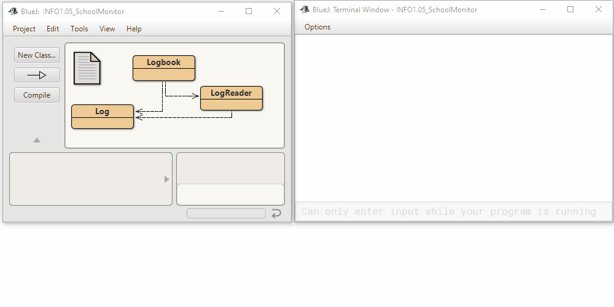

This project is the starting version for lambda and stream exercises;
here, the code is written in the traditional imperative style, using
for-each and while loops, and needs to be rewritten and extended

Based on the original by David J. Barnes and Michael Kölling
@author n-c0de-r
@version 2023.02.06

